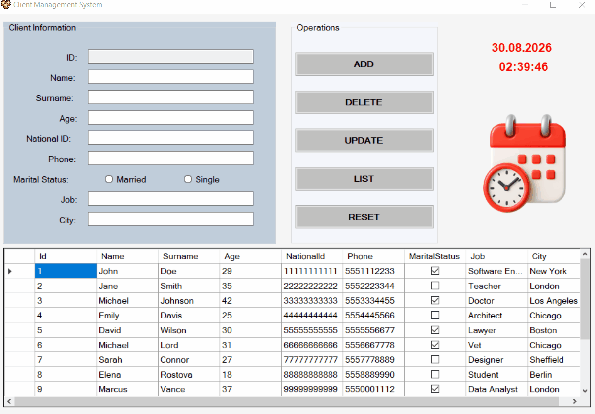

# 🏢 Client Management System

A desktop-based CRUD management application developed with **C# Windows Forms**, **ADO.NET**, and **Microsoft SQL Server**.

---

## 🎬 Demo & Preview

<p align="center">
  
</p>

---

## 📌 Features

- **Client Registration (ADD):** Adds new client records with required data validations.
- **Dynamic Listing (LIST):** Displays client records via `DataGridView` with locked column sorting for UI stability.
- **Record Selection:** Automatically populates form controls with client details upon row click.
- **Secure Updates (UPDATE):** Updates existing client records using parameterized SQL queries against SQL injection.
- **Record Deletion (DELETE):** Deletes client records using unique ID identification.
- **Form Reset (RESET):** Clears all input controls, unchecks radio buttons, and resets focus.
- **Live Clock:** Real-time date and time counter powered by a background `Timer`.

---

## 🛠 Tech Stack

- **Language:** C# (.NET Framework)
- **UI Framework:** Windows Forms (WinForms)
- **Database:** Microsoft SQL Server (T-SQL)
- **Data Access:** ADO.NET (`SqlConnection`, `SqlCommand`, `SqlDataAdapter`, `DataTable`)

---

## 🗄 Database Setup

Create a database named `ClientsDB` in SSMS and execute the table schema below:

```sql
CREATE TABLE Clients (
    Id INT IDENTITY(1,1) PRIMARY KEY,
    Name VARCHAR(50) NOT NULL,
    Surname VARCHAR(50) NOT NULL,
    Age TINYINT NULL,
    NationalId CHAR(11) NULL,
    Phone VARCHAR(10) NULL,
    MaritalStatus BIT NULL,
    Job VARCHAR(50) NULL,
    City VARCHAR(50) NULL
);
```

---
🚀 How to Run

1.Clone or download the repository:
https://github.com/halegulsipahi/ClientManagementSystem.git

2.Create the ClientsDB database and Clients table using the SQL query above.

3.Open ClientManagementSystem.slnx (or .sln) in Visual Studio.

4.Update the SQL connection string in frmClients.cs to match your local SQL Server instance:
Data Source=YOUR_SERVER_NAME;Initial Catalog=ClientsDB;Integrated Security=True;Encrypt=False

5.Press F5 to build and run the project.
